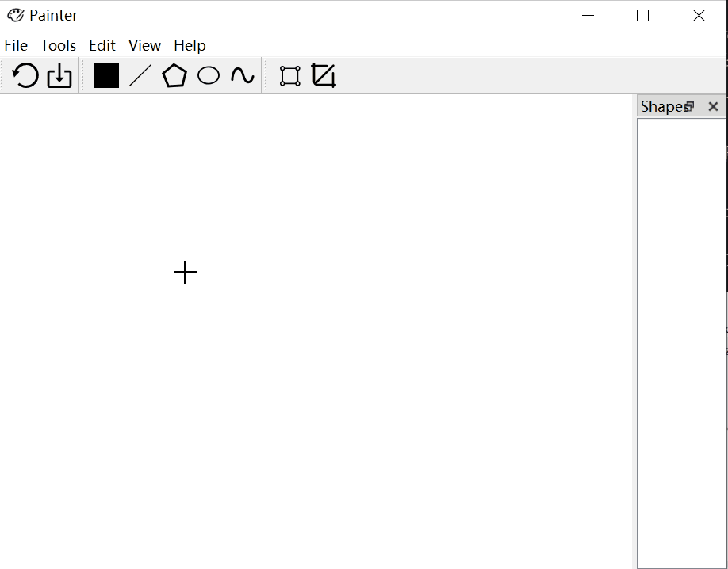

# Painter
该项目是基于Qt框架的绘图软件。它拥有以下功能：
- 图形界面模式
  - 设置画布大小，将画布内容保存至本地文件；
  - 设置画笔颜色；
  - 绘制直线、多边形、椭圆和曲线；
  - 对以上图元进行平移、旋转、缩放和裁剪；
- 命令行模式
  - 读取绘图指令脚本进行批处理。
  
下面是一些系统使用的说明，以帮助您快速编译、上手该软件。

## 开发环境
- Qt 5.12

## 如何编译
因为该项目是基于跨平台的Qt框架构建的，
所以您只需使用`qmake`指令生成当前平台的*Makefile*文件，
然后使用该平台的`make`指令编译，
比如在windows平台上，您如果安装了MSVC，就可以使用`NMAKE`指令编译源代码。

如果您装有QtCreator，那么可以直接使用QtCreator打开项目进行一键编译。

## 如何使用图形界面
下面一些是使用图形界面的动图演示。

### 设置画布大小

### 设置画笔颜色

### 绘制图元

### 保存画布

### 平移、旋转与缩放

### 裁剪线段

## 如何使用命令行