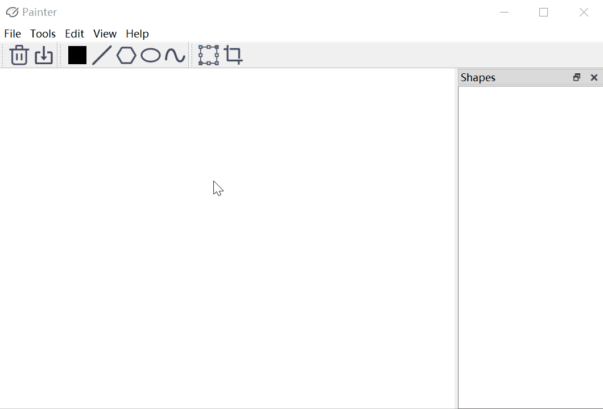
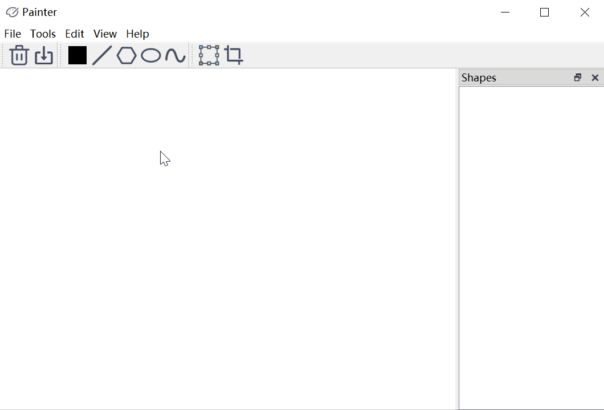

# Painter
该项目是基于Qt框架的绘图软件。它拥有以下功能：
- 图形界面模式
  - 设置画布大小，将画布内容保存至本地文件；
  - 设置画笔颜色；
  - 绘制直线、多边形、椭圆和曲线；
  - 对以上图元进行平移、旋转、缩放和裁剪；
- 命令行模式
  - 读取绘图指令脚本进行批处理。
  
下面是一些系统使用的说明，以帮助你快速编译、上手该软件。

## 开发环境
- Qt 5.12

## 如何编译
因为该项目是基于跨平台的Qt框架构建的，
所以你只需使用`qmake`指令生成当前平台的*Makefile*文件，
然后使用该平台的`make`指令编译。
比如在windows平台上，你如果安装了MSVC，就可以使用`NMAKE`指令编译源代码。

如果你装有QtCreator，那么可以直接使用QtCreator打开项目进行一键编译。

## 如何使用命令行界面
如果你需要使用命令行读取绘图指令脚本进行批处理，
那么可以使用如下的指令：
```
./Painter.exe <script-file> <output-dir> 
```
其中`<script-file>`指定了绘图指令脚本文件的路径，
`<output-dir>`指定了图像的保存目录。
这两个参数都是必选参数。

如果不指定任何参数，即单纯执行`./Painter.exe`指令，
那么图形界面就会被启动。

关于绘图指令的具体格式，请阅读
[materials/specification.md](materials/specification.md)。
[materials/script.txt](materials/script.txt)
给出了绘图指令脚本的示例。

## 如何使用图形界面
除了上面提到的命令行方式打开图形界面，
你也可以通过双击`Painter.exe`启动图形界面程序。
下面是一些使用图形界面的说明与动图演示。

### 设置画布大小
你可以通过菜单栏`File->Canvas Size`(快捷键Ctrl-R)来设置画布大小。



### 设置画笔颜色
你可以通过菜单栏`Tool->Pen Color`来设置画笔颜色。
但更加直接的方法是直接点击工具栏中的调色板。



### 绘制图元

### 保存画布

### 平移、旋转与缩放

### 裁剪线段
