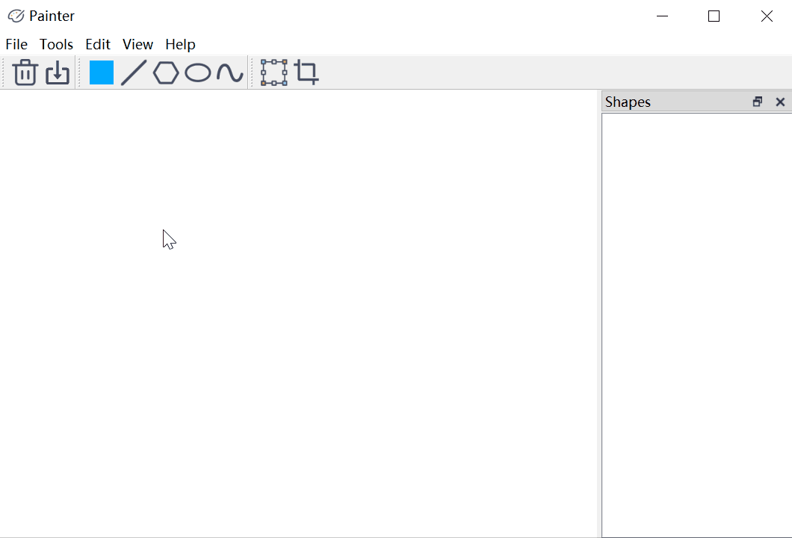

# Painter
该项目是基于Qt框架的绘图软件。它拥有以下功能：
- 图形界面模式
  - 设置画布大小，将画布内容保存至本地文件；
  - 设置画笔颜色；
  - 绘制直线、多边形、椭圆和曲线；
  - 对以上图元进行平移、旋转、缩放和裁剪；
- 命令行模式
  - 读取绘图指令脚本进行批处理。
  
下面是一些系统使用的说明，以帮助你快速编译、上手该软件。

## 开发环境
- Qt 5.12

## 如何编译
因为该项目是基于跨平台的Qt框架构建的，
所以你只需使用`qmake`指令生成当前平台的*Makefile*文件，
然后使用该平台的`make`指令编译。
比如在windows平台上，你如果安装了MSVC，就可以使用`NMAKE`指令编译源代码。

如果你装有QtCreator，那么可以直接使用QtCreator打开项目进行一键编译。

## 如何使用命令行界面
如果你需要使用命令行读取绘图指令脚本进行批处理，
那么可以使用如下的指令：
```
./Painter.exe <script-file> <output-dir> 
```
其中`<script-file>`指定了绘图指令脚本文件的路径，
`<output-dir>`指定了图像的保存目录。
这两个参数都是必选参数。

如果不指定任何参数，即单纯执行`./Painter.exe`指令，
那么图形界面就会被启动。

关于绘图指令的具体格式，请阅读
[materials/specification.md](materials/specification.md)。
[materials/script.txt](materials/script.txt)
给出了绘图指令脚本的示例。

## 如何使用图形界面
除了上面提到的命令行方式打开图形界面，
你也可以通过双击`Painter.exe`启动图形界面程序。
下面是一些使用图形界面的说明与动图演示。

### 设置画布大小
你可以通过菜单栏`File->Canvas Size`(快捷键`Ctrl-R`)来设置画布大小。


### 设置画笔颜色
你可以通过菜单栏`Tool->Pen Color`来设置画笔颜色。
但更加直接的方法是直接点击工具栏中的调色板。


### 绘制图元
你可以通过菜单栏`Tool->Line/Polygon/Ellipse/Curve`来选择图元绘制工具。
当然，更直接的方法是直接点击工具栏中对应的图标。
然后，你就可以使用鼠标在画布上绘制图元了：
- 直线：按下鼠标左键拖动松开，即可得到一条直线。

- 多边形：在画布上多次单击鼠标左键，得到多边形的顶点，
最后在起始点附近单击鼠标左键，就能得到一个闭合的多边形。
在多边形尚未闭合期间，你可以单击鼠标右键撤销之前的点。

- 椭圆：按下鼠标左键拖动松开，即可得到一个椭圆。

- 曲线：和多边形一样，你可以通过单击鼠标左键在画布上添加控制点，
并使用鼠标右键撤销上一个控制点。
最后，你可以单击最后一个控制点结束绘制
(也可以理解为双击鼠标左键创建最后一个控制点并结束曲线绘制)。


### 保存画布
你可以通过菜单栏`Tool->Save`(快捷键`Ctrl+S`)来保存当前图像。


### 平移、旋转与缩放
你可以通过菜单栏`Edit->Transform`(快捷键`Ctrl+T`)来进入变换模式。
不过工具栏中已经包含了相应的快捷方式，它是更加方便的选择。

你首先需要先在右侧图元列表中选中需要进行变换的图元，
于是画布上会相应地在图元上显示一个变换框：
- 在变换框内部按下鼠标拖动能平移图元。
- 在变换框边界上按下鼠标拖动能缩放图元。
- 在变换框外部按下鼠标拖动能旋转图元。
- 拖动变换框的中心点可以调整放缩/旋转中心。


### 裁剪线段
你可以通过菜单栏`Edit->Clip`来进入直线裁剪模式。
不过工具栏中已经包含了相应的快捷方式，它是更加方便的选择。

你首先需要先在右侧图元列表中选中需要进行裁剪的直线，
然后在画布上单击鼠标左键拖动，得到裁剪窗口。
松开鼠标左键后，裁剪窗口外的直线会被裁去。

对于非直线，裁剪会把它们直接删去。


